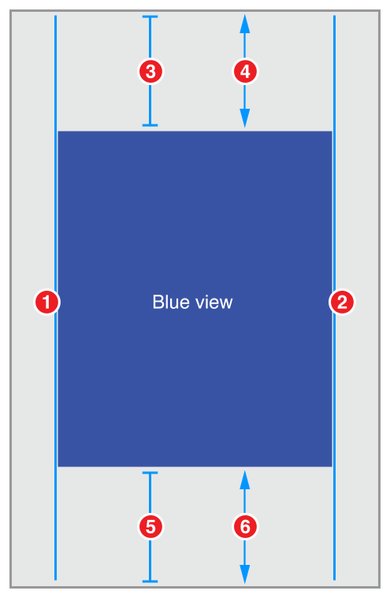
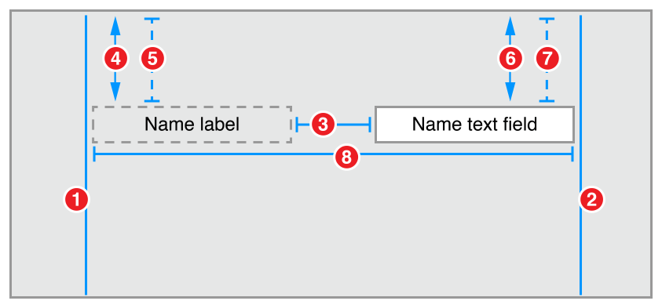

https://developer.apple.com/library/ios/documentation/UserExperience/Conceptual/AutolayoutPG/AnatomyofaConstraint.html#//apple_ref/doc/uid/TP40010853-CH9-SW1

不完全翻译

Auto Layout机遇view的约束来动态计算View层级中各个view的大小和位置。比如，你可以约束一个button使得它与一个ImageView水平居中，button的顶部与imageview的底部距离8个点。如果这个imageview的大小或位置变化，那么这个button的位置也会自动变化。

# Part I: Getting Started
## Understanding Auto Layout
### 外部变化(External Changes)

当superview的大小和形状变化时触发外部变化。根据这些变化，你需要更新view层级的布局。以下为一些外部变化的普通源：

- 用户调整了Window(OS X)
- 用户在iPad进入或离开Split View(iOS)
- 设备旋转(iOS)
- 电话和录音bar的出现或隐藏(iOS)
- 要支持不同的size classes
- 要支持不同的屏幕大小

大多数这些变化可以在运行时(runtime)发生，它们要去你的app动态响应。其他的，比如支持不同屏幕大小，则需要根据不同环境呈现。即使是在屏幕尺寸通常不会在运行时改变，创建一个自适应的界面也可以让你的app在iPhone4S，iPhon6 Plus，甚至iPad上运行的足够好。AutoLayout同样是支持iPad上Slide Over和Split Views的关键组件。

### 内部变化(Internal Changes)

当用户界面中的view或control的大小发生变化时触发内部变化。
一些内部变化的普通源：

- app显示的内容发生变化
- app支持国际化
- app支持动态类型(iOS)

当app的内容变化时，新的内容也许会要求不同的布局。这个通常发生在文字和图片的显示上。例如，一个新闻app需要根据独立新闻文章的大小来调整布局。简单来说，一个照片拼贴必须掌控图片的宽度范围和比例大小。

国际化app的布局必须考虑app支持的语言和地区的正确显示。国际化有3个主要需要考虑的地方。

首先，将界面翻译为另一种语言，label或要求不同的空间大小，比如德语一般会比英语占用的空间大，而日语则一般小。

第二，即使语言没有变化，不同地区的日期和数字格式也可能不一样。尽管这些变化有些微妙，但仍需要在界面中适应这些微小的变化。

第三，改变语言不仅仅对文字的大小有影响，甚至对布局的组织方式有影响。不同的语言使用不同的布局方向。比如，英语使用从左至右的方向，二Arabic和Hebrew使用从右至左的方向。通常界面的顺序需要遵从布局方向，英语中如果一个button在右下角，那么在Arabic中应该在左下角。

如果你的app支持动态类型，用户可以在app中调整字体大小。这回改变界面中任何文字性元素的宽高。如果用户在app运行时改变字体大小，那么字体大小和布局必须做出适应。

### Auto Layout与Frame-Based Layout比较

有3种方法可以对界面进行布局。代码编写、autoresizing mask来自动完成外部变化的响应、Auto Layout。

一般来说，通过设置view在层级中的frame来布局。这个frame包含了view相对于superview坐标系统的的原点，高度，和宽度。
为了布局出界面，你需要计算层级中每个view的大小和位置。然后如果发生变化，你需要重新计算所有受影响的view的frame。
在许多方面，使用代码来定义view的frame提供了更多的便利性和强大性。当变化发生时，你可以遍历地操作每个想要的变化。也因此，你必须自己管理所有变化，使得布局一个简单的界面需要更多的考虑成本来设计、调试、维护。创建一个真正的自适应界面增加一个数量级的困难。

你可以使用autoresizing masks来缓解一些努力。Autoresizing mask定义了在superview的frame变化时view该如何变化。着简化了适应外部变化布局的创建。

如果说autoresizing mask仅仅是一个编程级(Programmatick)布局的迭代提升，那么Auto Layout就是一个全新的范式。你需要考虑的是关系，而不是view的frame。

Auto Layout通过食用一些列约束(constraint)定义了界面。约束通常代表两个view间的关系。Auto Layout会通过每个view之间的约束来计算大小和位置。这样导出的布局可以动态响应内部变化和外部变化。

设计一些列约束来创建特殊行为的逻辑，与使用过程或面向对象编程的逻辑是大不相同的。幸运的是，掌握Auto Layout与掌握其他任何编程任务相比没有任何困难。这里有简单的两步：首先需要明白constraint-based layout的背后逻辑，之后需要学习API。


## Auto Layout Without Constraints

Stack View提供了简单的方式来利用AUtoLayout的力量，而不用介绍约束的复杂。一个Statck View定义了一行或者一列界面元素。Stack View通过其properties排列这些元素。

- axis:(UIStackView only)定义了statick view的方向，水平或垂直
- orientation:(NSStackView only)定义了statick view的方向，水平或垂直
- distribution:定义了views沿着axis的布局
- alignment:定义了views垂直于axis的布局
- spacing:定义了相邻views间的space

## 约束剖析(Anatomy of a Constraint)

view层级的layout被定义为一系列的线性方程。每个约束代表一个单独的方程。你的目标是声明一系列方程，但是有且仅有一个可能的结果。


约束表明，red View的leading edge必须在blue view的trailing edge的8个点之后。
这个方程有几个部分：

- Item 1
    + 方程的第一个部分，此处为red view。这个对象需要是一个view或者layout guide
- Attribute 1
    + 这个属性是item1的。此处为red view的leading edge
- Relationship
    + 这个关系是左右两个对象的。这个关系有“等于”、“大于等于”、“小于等于”三种关系中的一种
- Multiplier
    + Attribute 2的值乘以这个值。
- Item 2
    + 方程的第二个对象。此处为blue view。与Item 1不同的是，此对象可以留空。
- Attribute 2
    + 这个属性是Item2的，此处为blue view的trailing edge.如果Item2为空，这里必须为Not an Attribute
- Constant
    + 一个常量，浮点数offset，此处为8.0。这个值添加到Attribute2。

大多数约束定义了界面中两个View的关系。这些item可以表述views或者layout guides。约束同样可以定义同一个对象的两个不同attribute的关系，比如，设置高宽的ratio比例。同样可以设置高或宽为常量值。当Item2为空时，Attribute2需要设置为Not an Attribute，multiplier为0.0。

以下原则需要记得：

- 不可以约束一个size attribute到location attribute
- 可以只给size attribute赋值常量
- 对于location attribute，不可以将vertial attriburtes与horizontal attributes进行约束
- 对于location attribute，不可以将leading、trailing attributes与left、right attributes进行约束

举例来说，没有附加上下文，设置对象的top为20是没有意义的。你必须定义对象与其它对象的location attributes，比如，与superview的top距离20个点。但是，这是对象的高度为20是完全有效的。

```
// Setting a constant height
View.height = 0.0 * NotAnAttribute + 40.0

// Setting a fixed distance between two buttons
Button_2.leading = 1.0 * Button_1.trailing + 8.0

// Aligning the leading edge of two buttons
Button_1.leading = 1.0 * Button_2.leading + 0.0

// Give two buttons the same width
Button_1.width = 1.0 * Button_2.width + 0.0

// Center a view in its superview
View.centerX = 1.0 * Superview.centerX + 0.0
View.centerY = 1.0 * Superview.centerY + 0.0

// Give a view a constant aspect ratio
View.height = 2.0 * View.width + 0.0
```

特别需要注意的是，上面的等于("=)不代表赋值，而是代表相等。

当autolayout解决这些等式时，并不是将右侧的值赋给左侧，而是计算attribute1和attribute2使得等式成立。这代表我们可以自由重排等式的items。比如下表中的等式与Note中的是一样的意思。
```
// Setting a fixed distance between two buttons
Button_1.trailing = 1.0 * Button_2.leading - 8.0
 
// Aligning the leading edge of two buttons
Button_2.leading = 1.0 * Button_1.leading + 0.0
 
// Give two buttons the same width
Button_2.width = 1.0 * Button.width + 0.0
 
// Center a view in its superview
Superview.centerX = 1.0 * View.centerX + 0.0
Superview.centerY = 1.0 * View.centerY + 0.0
 
// Give a view a constant aspect ratio
View.width = 0.5 * View.height + 0.0
```

Note

> When reordering the items, make sure you invert the multiplier and the constant. For example, a constant of 8.0 becomes -8.0. A multiplier of 2.0 becomes 0.5. Constants of 0.0 and multipliers of 1.0 remain unchanged.
> 

不同的程序员实现同様的约束可能会有不同的方式，下面有一些指南：

- 整数乘数优先于分数乘数。
- 正常量优先于负常量
- 只要可能，views应该以layout顺序显示：leading-trailing, top-bottom

## 创建清晰明确的(Nonambiguous)可满足的(Satisfiable)布局

使用autolayout时，目标是提供一系列等式，这些等式有且仅有一个可能的解决方案。模棱两可的约束有不止一个可能的解决方案。不满足条件的约束没有有效的解决方案。

通常，约束必须定义每个view的size和position。假设superview的大小已经设置，一个模棱两可的、可满足的layout要求每个view每个dimension有两个约束（不在superview中计算）。但是，当你选择使用哪个约束时，你有一个宽泛的选项。比如，下面三个layouts都创建了清晰明确的，可满足条件的layouts(仅显示horizontal约束):


注意，每个布局有一个view、两个horizontal约束。在每个情况下，约束完全定义view的宽度和horizontal position。这代表所有的布局都产生在horizontal的一个清晰明确的、可满足的layout。但是它们并不是完全相等的。考虑下档superview变化时会发生什么。

第一种布局，view的宽度没有变化。多数时候，这不是你想要的。实际上，一个通常的规则时，你应该避免将常量size赋值给view。autolayout是设计用来创建layouts以动态适应。当你给view一个固定的size的时候，你就将这个能力短路了。

第二种、第三种布局则产生相同的行为：在superveiw的宽度变化时，view与superview间一直是一个固定的margin。但是它们不一定相等。通常，第二个更容易理解，第三个更有用，尤其是当你将一系列对象举重对齐时。

想象一个更复杂的情况。在iPhone上挨着展示两个view。你想要确定每个view都有不错的边白，并且有同様的宽度。它们应该在设备旋转时正确变化。应该是如图效果：


## 不等约束(Constraint Inequalities)

不等约束有三种 equal to、greater than or equal to、less than or equal to

## 约束优先级(Constraint Priorities)

默认的，所有的约束都要求。autolayout必须计算所有的解决方案来满足约束。如果没有，就会产生错误。autolayout会将不满足的信息打印到console，并选择一个约束来废弃，然后重新计算。

你可以创建可选约束。所有的约束的优先值为1到1000。约束值为1000的为必须，其他为可选。

当计算解决方案时，autolayout尝试根据优先级由高到低的顺序计算来满足所有约束。如果不能满足某个可选约束，这个约束会被跳过，继续下一个约束。

即使一个可选约束不能满足，它仍然会影响布局。如果在跳过这个约束后有任何比明确的，系统会选择最接近约束的解决方案。unsatisfied optional constraints act as a force pulling views towards them.

可选约束和不等约束通常在一起使用。

In fact, priorities should general cluster around the system-defined low (250), medium (500), high (750), and required (1000) priorities. 

## Intrinsic Content Size (内置内容大小)

目前为止，所有的例子都使用约束来定义position和大小来定义。但是一些view根据内容拥有natural size。这个叫做Intrinsic Content Size。例如，button的instrinsic content size是标题的大小加上一个小的margin。

不是所有的view都有instrinsic content size，instrincsic content size可以定义view的高度、高度、或者两者都有。

一个没有image的imageview没有instinsic content size。当你加入image时，就会设置为image的size。

一个text view的instrinsic content size根据内容、是否启用scroll、其他对它的约束来确定。例如，当启用scroll时，没有instrinsic content size。禁用scroll时，默认根据文字大小来计算（不包含任何line wrapping）。例如，如果文字中没有任何“return“，将文字作为一行来计算所需的宽高。如果给它加了宽度约束，intrinsic content size根据此宽度计算展示文字所需高度。

autolayout在每个坐标轴使用一对约束来表征view的intrinsic size。Content Hugging将view向里压紧，因此来紧贴内容。compression resistance将view向外扩张，因此不夹紧内容。（译注：可以简单理解为抗拉伸、抗压缩）。

```
// Compression Resistance (译注：抗压缩)
View.height >= 0.0 * NotAnAttribute + IntrinsicHeight
View.width >= 0.0 * NotAnAttribute + IntrinsicWidth
 
// Content Hugging (译注：抗拉伸)
View.height <= 0.0 * NotAnAttribute + IntrinsicHeight
View.width <= 0.0 * NotAnAttribute + IntrinsicWidth
```

这两个中每个约束可以有自己的优先级。默认的，view有一个250的优先级content hugging（抗拉伸）和750的compression resistance（抗压缩）。因此，拉伸一个view比压缩一个view要容易。对于大多数control，这是期望的行为。比如，拉伸一个button到比他intrinsic content size大是安全的，而压缩可能会造成内容截断。注意：IB可能会偶尔修改这些优先级来防止打结。

如果可能，在任何时候，都在布局中使用view的intrinsic content size。这可以使你的布局动态适应内容的变化。它同様可以减少大量约束来创建明确的、不冲突的布局。但是你让然需要管理view的content-hugging和compression-resistance优先级。这里有一些针对intrinsic content size的guidlines：

- 当拉伸一些列的来填充空间时，如果所有的viuew有相同的content-hugging优先级，这个布局是不确定的。autolayout不知道哪个view应该被拉伸。一个普通的例子是，label和text field组。通常你想要text field被拉伸来填充剩余的空间，而label保持它的intrinsic content size。为了保证这些，需要确保text field的horizontal content-hugging优先级比label的低。事实上，这个例子很普遍，IB会自动帮你完成，也就是设置所有label的content-hugging优先级为251。如果你使用代码手动创建布局，需要自己设置content-hugging的优先级。
- 古怪、不期望的布局通常在view包含不可见背景时发生（如button和label）。这些view经常被拉伸到比intrinsic content size大。实际问题并不显眼，因为文字仅仅是在错误的地点显示。为了防止不期望的拉伸，需要增大content-hugging的优先级
- Baseline约束只在intrinsic content的高度上生效。如果view只在竖直防线上拉伸货压缩，baseline约束不不会正常对齐。
- 一些view比如switch，应该总是根据它们的intrinsic content size显示，增加他们的CHCR(Content-Hugging and Compression-Resistance)是为了防止拉伸和压缩。
- 避免将required优先级赋予给view。相对于偶然创建一个冲突，错误的size更好一些。如果一个view应该经常使用它的intrinsic content size，考虑使用very high priority(999)代替。这种方法通常会使得view不会被拉伸或压缩，但是仍然会提供一个应急压力值（emergency pressure valve），为了以防万一这个view会在比你期望的大（或小）的环境中显示。

## Intrinsic Content Size Versus Fitting Size

intrinsic content size充当一个autolayout的输入。当一个view拥有intrinsic content size时，系统会产生一些约束，来表征这个size，并使用这些约束来计算布局。

fitting size，在另一方面，是autolayout引擎的输出。是根据view的约束计算而来的size。如果一个view使用autolayout来布局它的subviews，那么系统也许可能根据内容计算出真对这个view的fitting size。

Stack view是一个很好的例子。系统通过隔离其他约束，根据他的内容计算stack view的size。在许多方面，stack view如果有intrinsic conten size，会如下表现：你可以仅仅用一个单独的vertical和一个单独的horizontal约束定义位置来确定一个有效的布局。但是size是有autolayout来确定的，它不是autolayout的输入。设置stack view的CHCR是没有效果的，因为stack view没有intrinsic content size。

若你需要调整stack view相对于外部的fitting size，要么创建明确的约束来记录这些关系，要么修饰stack内容相对于stack外部对象的CHCR优先级。

一些值的解释

- Height/Width，仅可与Height,Width结合使用，不可为负。
- Top/Bottom/BaseLine，向下移动屏幕时增加，仅可与CenterY, Top, Bottom, Baseline结合使用
- Leading/Trailing，向trailing侧移动时，值变大。对于左－右布局来说，向右移动增大；对于右－左布局来说，向左移动增大。仅可与Leading, Trailing, CenterX结合使用
- Left/Right,向右移动增大。仅可与Left, Right, CenterX结合使用。避免使用Left/Right,使用Leading/Trailing代替，这个允许布局适应阅读方向。默认的，阅读方向根据当前语言决定。但是你可以需要的时候重写。iOS中，设置superview的semanticContentAttribute来指定是否在left-to-right, right-to-left语言间切换时翻转。
- CenterX/CenterY,可与CenterX,Leading,Trailing,Right,Left配合使用。CenterY可与CenterY,Top,Bottom,Baseline配合使用。


## IB中使用约束


全新打开时，放入一个view，IB会自动出案件一些模版约束，定义了当前大小、与左上角的位置。运行时即按此约束运行。当你添加了一个约束之后，系统会移除模版所有约束。

IB中Constraint标注线的区分：

- l-bars(lines with T-shaped end-caps)具有T形终止端的线。
    + 显示大小。两个对象间距或者对象的宽高
- Plain lines(straight lines with no end-caps)无终止端的直线。
    + 显示边缘的对齐。比如IB中使用简单的线对齐多个view的leading
    + 连接间距为0的对象
- Solid Lines.实线。
    + 代表其优先级为“required”，1000
- Dashed Lines.虚线。
    + 代表其优先级为“optional”，<1000
- Red Lines.红线。
    + 某个受此约束的对象有错误。
- Orange Lines.橘色线。
    + 某个受此约束的对象的frame没有在正确位置
    + IB同样会用dashed outline显示计算出来的位置
- Blue Lines.蓝色线。
    + 受此影响的对象有一个明确的、可满足的布局，并且这个对象的位置与autolayout计算出的一致
- Equal Badges.等于标志
    + 代表两个对象的高或宽相等。
- Greater-than-or-equal and less-than-or-equal badges.大于等于、小于等于标志
    + 类似等于标志


约束的identifier属性允许你提供一个描述性名称。你可以利用这个名称来辨识这个约束（console log中或者其他debugging调试中）。


你可以将一个约束标志为placeholder。这样的约束仅在设计阶段存在，不在app运行时被包含进布局中。一般在你想要动态添加约束时需要添加这样的约束。通过临时加入这样的约束，可以通过IB明确是否有警告或错误。

不可以把一个对象上的约束移动到另外一个对象上去。若想实现此，需要将其先删除，然后再添加。

## 设置Content-Hugging和Compression-Resistance优先级


通过IB设置intrinsic content size。IB默认使用view的intrinsicContentSize方法的返回值。但是可以再设计阶段使用不同的大小，也就是将intrinsic content size改为placeholder.但是，这个placehoder仅影响IB。在运行时是没有效果的。

## iOS独有特色

iOS在与autolayout的交互上添加了一些独有特色。包括top layout guide和bottom layout guide，一些布局margin，view的可读内容guide，view的寓意内容。

### Top and Bottom Layout Guides

top、bottom layout guide代表当前激活viewconroller的可见内容区域的上下边缘。

Layout guides实现了UILayoutSupport协议，这个协议提供了一个length属性，这个属性测量了guide和这个view对应边缘的距离。特别的：

- 对于top layout guide,length代表了view controller的view的顶部与覆盖在这个view上的最下面的bar的底部的距离
- 对于bottom layout guide, length代表了viewcontroller的view的底部与覆盖在这个view上的bar的顶部的距离

guide同样可以充当约束中的对象，支持top, bottom, height属性。一般为top layout guide的bottom，bottom layout guide的top。guide同样提供了topAnchor, bottomAnchor, heightAnchor属性来简化代码创建约束。

## Layout Margins

Autolayout为每个view定义了margins。这些margins描述了view与其subvews间的优先spacing。你可以使用layoutMargins或者layoutMarginsGuide属性来access view的margins。layoutMargins属性允许你以UIEdgeInsets结构set/get margins。layoutMarginsGuide属性提供了以UILayoutGuide对象形式的对margins的只读access。另外，使用preservesSUperviewLayoutMargins属性来决定view的margins如何与其superview的margin交互。默认的margin为每个边为8个点。

系统设置和管理view controller的root view的margins。top和bottom的margins为0点。side margins根据controller如何、在哪儿展示，但是不是16就是20点。你不可以改变这些margins。

### Readable Content Guides

view的readableContentGuide属性包含一个layout guide，这个layout guide为其内的text对象定义了最大最佳的宽度。理想地，内容足够窄，以至于用户可以不需要移动其头部就可以阅读。

这个guide总是在view的layout margin中居中，并且永远不会越过这些margins。guide的size会因系统动态类型的大小而不同。当用户选择大字体时，系统会创建更大的guide，因为用户通常会在阅读时将设备离远。

在IB中，Nike i设置view的margins是否表示layout margins还是readable content guide。如果你在view的size inspector中勾选了checkbox，view的margins的约束都会使用readable content guide。

在大多数设备上，readable content guides和layout margins只有一点设置没有区别。只有在iPad Landscape方向西才明显。

### Semantic Content (语义内容)

如果你使用leading、trailing约束来布局你的views，在你切换左－右、右－左语言时，views会自动flip位置。但是，一些界面元素不会根据阅读方向改变位置。比如，基于物理方向(up, down, left, right)的buttons总会保持在相同的相对方向。

view的semanticContentAttribute属性决定view的content是否会基于左－右、右－左语言flip。

在IB的attribute inspector中设置Semantic选项。

－ 如果是Unspecified,view的内容根据阅读方向flip.
－ 如果是Spatial, Playback, Force Left-to-Right，内容总是从左侧作为leading，右侧作为trailing布局.
- 如果是Force Right-to-Left，内容总是从右侧作为leading,左侧作为trailing布局

## 经验法则(Rules of Thumb)

- 永远不要使用frame,bounds,center属性指定view的几何结构。
- 尽可能使用stack view
    + stack view管理其内容的布局，极大简化了布局的约束逻辑。
    + 仅仅在statck view中无法提供你需要的行为时才去依靠自定义约束
- 在view和其相邻对象间创建约束
    + 如果你有两个相邻button，后一个的leading连接到前一个的trailing.
    + 一般不会穿过第一个button。
- 避免固定的高度或宽度
    + 这会丧失自适应的能力。
    + 但是你也许想要设置最大或最小的大小
- 如果设置约束有困难，可以尝试Pin, Align工具
- 自动更新对象frame时要小心
    + 如果设置不当，对象有时候会消失，或者跃出屏幕
- 确保布局中的所有view都有有意义的名字。
    + 这样可以更容易的使用工具找到view
    + 系统会根据button和label的文字自动命名
    + 其他的view需要在Identity Inspector中设置
    + （如果连接了IBoutlet也会自动命名）
- 总是使用leading和trailing约束，而不是right和left
- 在iOS中，使用如下的约束来做对viewcontroller的rootview的边缘
    + Horizontal Constraints.
    + Vertical constraints
- 当代码实例化view的时候，确保设置它的translatesAutoresizingMasskIntoConstraints属性为NO.
    + 默认下，系统根据view的frame和autoresizing mask自动创建一系列约束。当添加你自定义的约束时，它们不可避免的与自动生成的约束冲突。
- 注意iOS和OS X计算布局是不一样的
    + OS X中，autolayout可以修改window的内容和大小
    + iOS中，系统提供了大小和scene的布局，autolayout仅可以修改scene的内容


### 简单的布局




这个例子为蓝色View的top和bottom都创建了一个自适应margin。如果有bar，view的edge就距离bar有8个点。如果没有edge就距离superview20个点。

这个例子使用了layout guides来正确布局其内容。系统根据任何存在的bar和其大小来设置这些guides。Top layout guide挨着任何top bar的底部（比如statusbar、navigationbar）。Bottom layout guide挨着任何bottom bar的顶部（比如tabbar）。如果没有bar，系统根据superview对应的edge确定guide的位置。

这个例子使用了一组越苏来建立自适应行为。第一个约束是“required”，为“大于等于”约束。这个约束保证蓝色view的边缘始终距离superview的边缘至少20个点。效果上，它定义了最小的margin为20.

下一步，一个“optional“约束试图设置view距离对应的layout guide为8个点。因为这个约束为”optional“，如果系统无法满足这个约束，仍将尝试接近这个约束，and the constraint acts like a spring-like force, pulling the edge of the blue view towards its layout guide.

如果系统没显示bar，那layout guide与sueprvew的edge相等。蓝色view既距离superview的edge不能既是8个点，又是20（或更多）个点。因此，系统无法满足“optional”约束，但它仍然会试图接近，也就是设置margin最小为20个点。

如果bar显示了，两个约束均可满足。所有的bar最少为20点宽度。所以，如果系统放置蓝色view距离bar的edge距离8个点，保证了蓝色view距离superview的edge超过20个点。

## 示例



1. Name Label.Leading = Superview.LeadingMargin
2. Name Text Field.Trailing = Superview.TrailingMargin
3. Name Text Field.Leading = Name Label.Trailing + Standard
4. Name Label.Top >= Top Layout Guide.Bottom + 20.0
5. Name Label.Top = Top Layout Guide.Bottom + 20.0 (Priority 249)
6. Name Text Field.Top >= Top Layout Guide.Bottom + 20.0
7. Name Text Field.Top = Top Layout Guide.Bottom + 20.0 (Priority 249)
8. Name label.Baseline = Name Text Field.Baseline

> To have the text field stretch to fill the available space, it’s content hugging must be lower than the label’s. By default, Interface Builder should set the label’s content hugging to 251, and the text field to 250. You can verify this in the Size inspector.

> This recipe uses a pair of constraints for each control. A required, greater-than-or-equal constraint defines the minimum distance between that control and the layout guide, while an optional constraint tries to pull the control to exactly 20.0 points from the layout guide.
> 
> Both constraints are satisfiable for the taller constraint, so the system places it exactly 20.0 points from the layout guide. However, for the shorter control, only the minimum distance is satisfiable. The other constraint is ignored. This lets the Auto Layout system dynamically recalculate the layout as the height of the controls change at runtime.

注意

> Be sure to set the priority of the optional constraints to a value that is lower than the default content hugging constraint (250). Otherwise, the system breaks the content hugging constraint and stretches the view instead of repositioning it.

> This can be particularly confusing when working with layouts that use baseline alignments, because the baseline alignments are only valid if the text views are displayed at their intrinsic content height. If the system resizes one of the views, the text may not line up properly, despite having a required baseline constraint.


## 调试autolayout

> always fix unsatisfiable constraint errors when you detect them. To help ensure that you catch nonobvious errors during testing, set a symbolic breakpoint for UIViewAlertForUnsatisfiableConstraints.

> Unsatisfiable constraints are relatively easy to fix. The system tells you when unsatisfiable constraints occur and provides you with a list of conflicting constraints.

>As soon as you know about the error, the solution is typically very straightforward. Either remove one of the constraints, or change it to an optional constraint.

Unsatisfiable constraints 处理

- Unsatisfiable constraints often occur when programmatically adding views to the view hierarchy.
By default, new views have their translatesAutoresizingMaskIntoConstraints property set to YES. Interface Builder automatically sets this property to NO when you begin drawing constraints to a view in the canvas. However, when you’re programmatically creating and laying out your views, you need to set the property to NO before adding your own, custom constraints.IB中自动设置UIView的translatesAutoresizingMaskIntoConstraints为NO，但是代码写的时候不会，所以需要注意。

- Unsatisfiable constraints often occur when a view hierarchy is presented in a space that is too small for it.未满足约束经常发生在“view在太小的空间内显示”的情况下。
You can usually predict the minimum amount of space that your view has access to and design your layout appropriately.你可以经常预测最小空间并正确设计布局。 However, both internationalization and dynamic type can cause the view’s content to be much bigger than expected. 但是国际化和动态类型会搞破坏。As the number of possible permutations grows, it becomes increasingly difficult to guarantee that your layout will work in all situations.当可能的排列增长时，保证你的布局在所有的情况下工作正常将变成急速增长的困难。
Instead, you may want to build in failure points, so that your layout fails in a predictable, controlled manner.你想要构建失败点，这样你的布局会在可预测可受控的方式下失败。
Consider converting some of your required constraints into high-priority optional constraints. 考虑将你的“requried”约束转化为“高优先级”的“optional”约束。These constraints lets you control where your layout will break when a conflict occurs.这些约束让你在冲突发生时控制哪里你的布局中断。
For example, give your failure point a priority of 999.例如，给你的失败点999的优先级。 Under most circumstances, this high-priority constraint acts as if it were required; 在多数情况下，这个高优先级约束像“requred”一样表现。however, when a conflict occurs, the high-priority constraint breaks, protecting the rest of your layout.但是，当冲突发生，高优先级约束中断，保护剩下的布局。
Similarly, avoid giving views with an intrinsic content size a required content-hugging or compression-resistance priority.简单的，避免给views的intrinsic content size一个"Requred"级别的content-hugging或者compression-resistance。Typically, a control’s size acts as an ideal failure point.一般来说，一个控件的大小充当理想的失败点。 The control can be a little bigger or a little smaller without having any meaningful effect on the layout.控件可以大一点或者小一点，而在布局上没有有意义的效果。
Yes, there are controls that should only be displayed at their intrinsic content size;是的，有些空间应该仅仅以它们的"intrinsic content size"展示。 however, even in these cases it is usually better to have a control that is a few points off rather than just letting your layout break in unpredictable ways.但是，即使在这些情况下，通常有一些偏差比让你的布局以未知的方式中断要好一些。


## Ambiguous Layouts 有歧义的布局

通常在约束有两个及以上有效solutions的情况下发生。主要有两个情况：

- 布局需要额外的约束才能确定每个view的位置
- 布局有同优先级且冲突的optional约束，导致系统不知道舍弃哪个约束。
    + 可以改变约束的优先级。系统会舍弃低优先级的那个。

与unsatisfiable layouts一样，IB不能检测出所有的歧义。只有通过测试才能发现更多错误。

当有歧义的布局在运行时出现时，auto layout选择一个可能的solution。这意味着可能不会像你期望的那样布局。另外咩有警告会显示在console中，也没有为ambiguous布局设置断点的方法。

所以，ambiguous布局经常比unsatisfiable布局难以检测和定位。即使从来看ambiguity有明显的可见效果，仍然难以决定是否因为ambiguity导致错误还是因为你的布局逻辑。

> 幸运的是，有一些方法你可以调用来定位ambiguous布局。所有的这些方法只能用于挑食。在任何你能access到view hierarchy的地方设置断点，然后在console里面调用。

- hasAmbiguoursLayout.
    + 适用于iOS和OS X。在一个misplacedview上调用。返回YES或NO.
- exerciseAmbiguityInLayout. 
    + 适用于iOS和OS X。在有ambiguous布局的view中调用。
    + This will toggle the system between the possible valid solutions.
- constraintsAffectiongLayoutForAxis:.
    + 适用于iOS.在view上调用。
    + It returns an array of all the constraints affecting that view along the specified axis.返回此坐标轴上影响此view的所有约束的集合。
- constraintsAffectingLayoutForOrientation:
    + 适用于iOS.在view上调用。
    + It returns an array of all the constraints affecting that view along the specified orientation.返回此坐标轴方向上影响此view的所有约束的集合。
- _autolayoutTrace.
    + iOS的私有方法。在view上调用。
    + 返回包含此view的整个view hierarchy的诊断信息。
    + Ambiguous views are labeled, and so are views that have translatesAutoresizingMaskIntoConstraints set to YES.

你可能需要在console中使用objc语法。比如，在断点处异常，console中输入 _call [self.myView exerciseAmbiguityInLayout]_ 。输入 _po [self.myView autolayoutTrace]_ 来打印包含myview的view hierarchy的诊断信息。

> 注意
> 
> 确保在运行上述诊断方法前修复了所有IB找到的issues。IB尝试修复任何它找到的错误。这代表如果它找到了ambiguous布局，它会加入约束以至于布局不再有ambiguous.
> 
> 作为结果，
> hasAmbiguousLayout返回NO.
> exerciseAmbiguityInLayout不显示任何效果。
> constraintsAftterLayoutForAxis:也许会返回额外的、未期望的约束

## 逻辑错误Logical Errors

没有工具或step-by-setp知道。修复逻辑错误一般需要 _experiments and iterative tests_ 来定位、修复。以下有几个建议也许会有帮助：

- 检查已存在的约束
    + 确认你没有missed任何约束或偶然添加的不需要约束
    + 确认所有的约束都被连接到正确的对象和属性
- 双击View的frames.
    + 确认没有不期望的拉伸、压缩
    + 这点对不可见背景的view（如label、button）特别重要
    + 这些对象被不期望的resize时是不明显的
    + resizing的一个重要特征是baseline-aligned view没有正确的line up。
    + 这是因为baseline alignment仅仅在view以其intrinsic content height显示时起作用
    + 如果你在vertical方向拉伸或压缩view，text会神秘的在错误的位置显示
- 如果一个控件总是与其intrinsic content size匹配，给它一个非常高的content-hugging和compression-resistance优先级(如999)
- 检查任何关于布局的假设，添加明确的约束来保证这些假设成立。
    + 记住，unsatisfiable布局一般时最容易找到和修复的问题，添加额外的约束，直到有冲突，然后检查并修复冲突
- 试着明白为什么给定的约束可以产生你所见的效果。如果明白了，你就能很好的修复它。
- 对应约束的检验。
    + auto layout对于同一问题一般会给你几种不同的解决方案。另一种方式也许会修复问题或至少找到问题简单点。

## 调试技巧与提示


