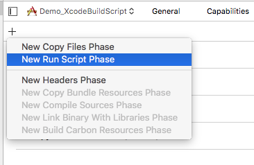
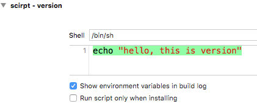
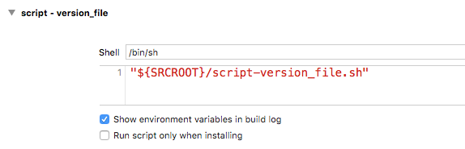
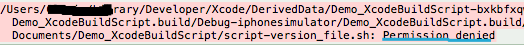
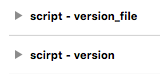

<!--
 Xcode Run Script设置
 -->

## 简介

可以借此做一些工作，例如更改版本号等。下面主要以更改版本号为例。

根据观察是在xcode本身的build完成后，才执行run script。


## 方式一：嵌入到工程配置中

> 嵌入到工程配置中也就是将脚本写到Xcode工程文件中去，无需额外的文件，具体步骤为：

- 选中“Target” -> “Build Phases”，点击左上角的“＋”号，选择“New Run Script Phase“

  

- 在输入框中输入` echo "hello, this is version" ` , 其它不用设置

  

- 编译工程，查看build记录，会发现打印出的语句

  


## 方式二：加载单独文件

> 加载单独文件也就是将script写成一个文件，例如 `script-version_file.sh` 文件。而不是将其直接写入Xcode工程文件中。

将它放入工程根目录，里面内容为：

```
# 执行命令chmod "a+x" script-version_file.sh解决权限问题
# ...script-version_file.sh: Permission denied
echo "hello, this is version_file"
```

这种方式与方式一一样，只不过，这次输入框输入这个文件的地址，如下：

  

但是这样编译发现会提示权限错误：

  

这是，执行命令“chmod "a+x" script-version_file.sh”即可修复，之后编译，可以看到build的日志：

  

## 其它

- 可以添加多个run script，执行顺序取决于其在Xcode中的顺序

  

- 这两种方式可以混用，也就是既可以有方式一、也可以有方式二