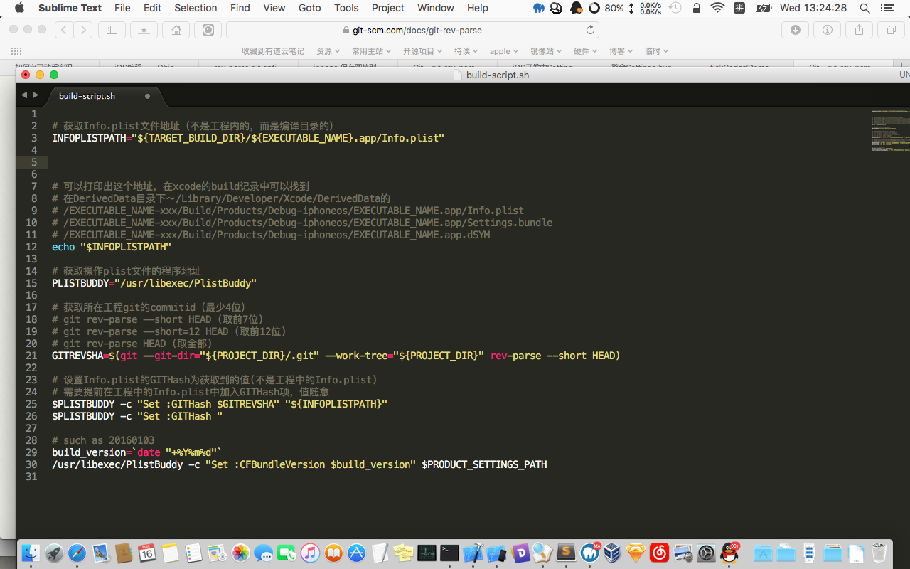

Tags: Xcode iOS bundle info plist version script
Status: public
Toc: yes


# 一、版本号规定
## 主版本号
- **第一位：整体架构修改、整体设计修改、很少动（此位变化时，后面2位归零）**
- **第二位：增加功能，如增加用户中心、增加评论等**
- **第三位：修改bug、每次编译重新发布后增加**
- **第二位、第三位独立增长，即第二位增加后，第三位不归零**
- 为3位数字以"."连接，如“1.2.377”
- 内测版本号为“0.x.xxx”，如“0.4.1298”
- 正式版本号为“1.x.xxx”，如“1.5.2847”
- 第三位可以无限多个，每次＋1

## 编译版本号
- 为8位正整数，如“201601041325”，代表2016年01月04日13:25编译

# 二、Xcode版本号说明
- “**Bundle versions string, short**”，即**CFBundleVersion**，

对应主版本号，如“1.4.5234”

- “**Bundle version**”，**CFBundleShortVersionString**，

对应编译版本号，如“201601041537”

# 三、Xcode版本号脚本
## 1.将脚本嵌入到Xcode工程中

将代码直接嵌入到工程之中，而不是单独的文件

选择 Xcode -> Target -> Build Phases -> + -> New Run Script Phase，填入以下内容
```
# 获取系统时间，形如“201603101434”
build_time = `date "+%Y%m%d%H%M"`
# 将build_time设置到plist文件中
/usr/libexec/PlistBuddy -c "Set :CFBundleVersion $build_time" $PRODUCT_SETTINGS_PATH
# 或者也可以使用其他方式设置
/usr/libexec/PlistBuddy -c "Set :CFBundleVersion $buildNumber" "${PROJECT_DIR}/${INFOPLIST_FILE}" 
/usr/libexec/PlistBuddy -c "Set :CFBundleVersion $buildNumber" "$INFOPLIST_FILE"
```

## 2.使用单独的脚本文件(需要查找)
<font color=blue>需要查找！！！！！</font>

## 附1.取出plsit中的一些信息
```
buildNumber=$(/usr/libexec/PlistBuddy -c "Print :CFBundleVersion" "${PROJECT_DIR}/${INFOPLIST_FILE}")  
shortVersion=$(/usr/libexec/PlistBuddy -c "Print :CFBundleShortVersionString" "${PROJECT_DIR}/${INFOPLIST_FILE}")  
```

## 附2.如果buildNumber是一个整形，可以这样做递增：
```
buildNumber=$(($buildNumber + 1))  
```

## 附3.如果仅仅只想在Release（如Archive等）的时候更新Build，可以尝试加入判断：
```
if [ "${CONFIGURATION}" = "Release" ]; then  
# code here
fi  
```

## 附4.date格式

| 格式 | 说明 | 示例 |
|-------------:|-------------:|-------------:|
| %S | 秒数 | 54 |


## 附5.iOS中获取两种版本号
```
NSString *mainVersion = [[[NSBundle mainBundle] infoDictionary] objectForKey:@"CFBundleShortVersionString"];
NSString *buildVersion = [[[NSBundle mainBundle] infoDictionary] objectForKey:@"CFBundleVersion"];
```

# 四、与git结合（仅供参考）

可以考虑与git相结合，将build_time设置为commitid，这样可以在发布后根据build_time查找所对应的源码commitid

考虑以下几点需求：

- 程序发布后，获取主版本号，build版本号，如果有问题，通过主版本号、build版本号找到对应代码
- 尽量少的改动info-plist的build版本号，以免造成git污染

所以可以按以下解决

- build_time版本号采用commitid比较方便，这样就可以通过git纪录，找到对应的问题出在哪次commit对应的代码上
- 在debug时，不改动info-plist的build版本号，以免造成git污染
- 在deubg时，使用日期201603031234作为build版本号
- 在release时，改动info-plist的build版本号，且使用commitid作为build版本号
- commit代码，得到commitid-1234，之后编译得到release版本，将commitid－1234写入到info-plist，再次提交，完成这一版本

另外，完全可以在commit信息中表明哪次commit是release版本，所以此处的与git结合看起来是个。。。

# 五、debug与release下区别对待

为了在更改build_time时不污染git，可以采用如下策略

- debug下不改变工程中info-plist中的build_time，而是改变编译目录的，如下：
```
/usr/libexec/PlistBuddy -c "Set :CFBundleVersion $build_time" "${TARGET_BUILD_DIR}/${INFOPLIST_PATH}"
```
- release下则改变工程中的info-plist中的build_time，如下
```
/usr/libexec/PlistBuddy -c "Set :CFBundleVersion $build_time" $PRODUCT_SETTINGS_PATH
```

如此，完整的代码为：
```
build_time = `date "+%Y%m%d%H%M"`
if [ "${CONFIGURATION}" = "Debug" ]; then  
/usr/libexec/PlistBuddy -c "Set :CFBundleVersion $build_time" "${TARGET_BUILD_DIR}/${INFOPLIST_PATH}"
else if [ "${CONFIGURATION}" = "Release" ]; then  
/usr/libexec/PlistBuddy -c "Set :CFBundleVersion $build_time" $PRODUCT_SETTINGS_PATH
else
# other code, echo可以在xcode的build log中看到
echo "Other config: ${CONFIGURATION}"
fi
echo "Updated ${TARGET_BUILD_DIR}/${INFOPLIST_PATH}"

```

# 六、一些命令

git获取最后一次commitid，得到b77c8f3df96a3bcf39222bab6c954e3f434ce12e（但Xcode中显示为b77c8f3df96a，不知为何）
```
git rev-parse HEAD
```

git获取分支名字
```
git rev-parse --abbrev-ref HEAD
```

git获取提交次数
```
git rev-list --all |wc -l
```

Xcode script中获取commit次数与branch名字，如"3-master"(http://www.cnblogs.com/skyming/p/3978424.html)

```
git=`sh /etc/profile; which git`
appBuild=`"$git" rev-list --all |wc -l`
branchName=`"$git" rev-parse --abbrev-ref HEAD`
/usr/libexec/PlistBuddy -c "Set :CFBundleVersion $appBuild-$branchName" "${TARGET_BUILD_DIR}/${INFOPLIST_PATH}"
echo "Updated ${TARGET_BUILD_DIR}/${INFOPLIST_PATH}"
```


