# 动态库

新建一个workspace，添加两个工程，一个为普通的single view application，一个为iOS中的cocoa touch framework。如图：

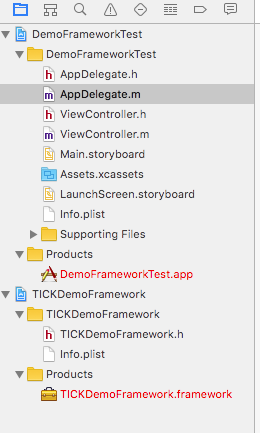

在framework工程中加入两个类TICKDemo和TICKDemoPrivate。前者为外部可以调用的，需要暴露header；后者仅限内部实现调用，不暴露header。

TICKDemoPrivate.m里面的方法

```
#import "TICKDemoPrivate.h"

@implementation TICKDemoPrivate
- (NSString *)privateFuncName {
    return [NSString stringWithFormat:@"%d, %s", __LINE__, __PRETTY_FUNCTION__];
}
@end
```

TICKDemo.m，注意不要在TICKDemo.h中出现TICKDemoPrivate，因为其仅限内部调用

```
#import "TICKDemo.h"
#import "TICKDemoPrivate.h"

@interface TICKDemo ()
@property (nonatomic, strong) TICKDemoPrivate *privateObject;
@end

@implementation TICKDemo
- (NSString *)publicFuncName {
    NSString *publicName = [NSString stringWithFormat:@"%d, %s", __LINE__, __PRETTY_FUNCTION__];
    
    TICKDemoPrivate *privateObj = [[TICKDemoPrivate alloc] init];
    NSString *privateName = [privateObj privateFuncName];
    
    return [NSString stringWithFormat:@"%@\n%@", publicName, privateName];
}
@end
```

framework工程中还有一个TICKDemoFramework.h文件，这个文件相当于总的头部，引入这一个头部，就相当于引入多个头部，免去使用时的麻烦，比如AFNetworking是这样的。

```
#import <Foundation/Foundation.h>
#import <Availability.h>
#import <TargetConditionals.h>

#ifndef _AFNETWORKING_
    #define _AFNETWORKING_

    #import "AFURLRequestSerialization.h"
    #import "AFURLResponseSerialization.h"
    #import "AFSecurityPolicy.h"

#if !TARGET_OS_WATCH
    #import "AFNetworkReachabilityManager.h"
#endif

    #import "AFURLSessionManager.h"
    #import "AFHTTPSessionManager.h"

#endif /* _AFNETWORKING_ */
```

而本例中仅有两个类，并且只有一个类是需要公开的，因此这样写(注意它自带的注释)

```
#import <UIKit/UIKit.h>

//! Project version number for TICKDemoFramework.
FOUNDATION_EXPORT double TICKDemoFrameworkVersionNumber;

//! Project version string for TICKDemoFramework.
FOUNDATION_EXPORT const unsigned char TICKDemoFrameworkVersionString[];

// In this header, you should import all the public headers of your framework using statements like #import <TICKDemoFramework/PublicHeader.h>

#import <TICKDemoFramework/TICKDemo.h>
```

在framework的工程配置中，默认是这样的

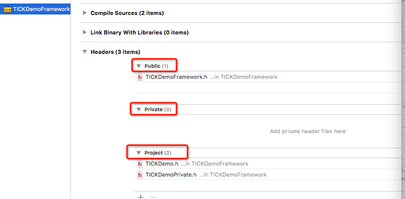

改成这样，编译得到生成的framework

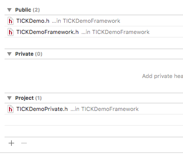

将其拖入到DemoFrameworkTest工程中去，我们发现它的header中是这样的

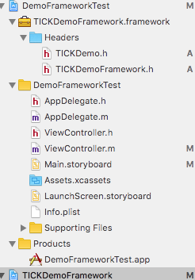

里面没有TICKDemoPrivate，不知道能不能运行，先不管它，写测试代码

```
#import "ViewController.h"
#import <TICKDemoFramework/TICKDemoFramework.h>

@interface ViewController ()
@property (nonatomic, weak) IBOutlet UILabel *infoLabel;
@end

@implementation ViewController

- (void)viewDidLoad {
    [super viewDidLoad];
    // Do any additional setup after loading the view, typically from a nib.
    TICKDemo *demo = [[TICKDemo alloc] init];
    _infoLabel.text = [demo publicFuncName];
}

@end
```

运行后发现成功了

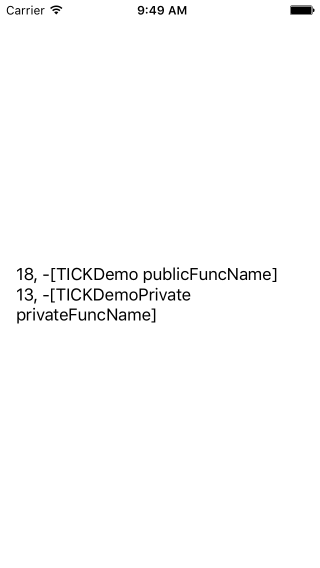

如果将TICKDemoPrivate放入Private组会怎么样呢？

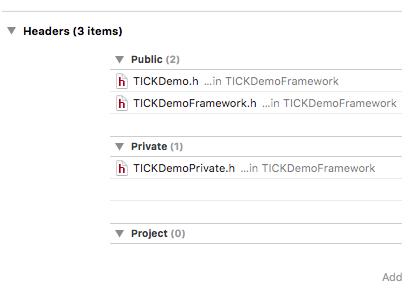

重复上述过程，编译，运行等。这时发现程序运行正常，但是framework发生了变化，多了一组PrivateHeaders

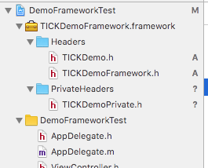

那么是不是可以外部使用呢？测试一下，发现没有任何错误，显示的结果也是TICKDemoPrivate的输出

```
#import "ViewController.h"
#import <TICKDemoFramework/TICKDemoFramework.h>
#import <TICKDemoFramework/TICKDemoPrivate.h>

@interface ViewController ()
@property (nonatomic, weak) IBOutlet UILabel *infoLabel;
@end

@implementation ViewController

- (void)viewDidLoad {
    [super viewDidLoad];
    // Do any additional setup after loading the view, typically from a nib.
    TICKDemo *demo = [[TICKDemo alloc] init];
    _infoLabel.text = [demo publicFuncName];
    
    TICKDemoPrivate *aaa = [[TICKDemoPrivate alloc] init];
    _infoLabel.text =  [aaa privateFuncName];
}

- (void)didReceiveMemoryWarning {
    [super didReceiveMemoryWarning];
    // Dispose of any resources that can be recreated.
}

@end
```

关于public、private、project header的解释为：

http://stackoverflow.com/questions/7439192/xcode-copy-headers-public-vs-private-vs-project


> Public: The interface is finalized and meant to be used by your product’s clients. A public header is included in the product as readable source code without restriction.
> 
> Public: 头部真正的公开，使用者可以看到，可以使用
>
> Private: The interface isn’t intended for your clients or it’s in early stages of development. A private header is included in the product, but it’s marked “private”. Thus the symbols are visible to all clients, but clients should understand that they're not supposed to use them.
> 
> Private: 头部公开，使用者可以看到，但应该知道不应该使用这部分
>
> Project: The interface is for use only by implementation files in the current project. A project header is not included in the target, except in object code. The symbols are not visible to clients at all, only to you.
> 
> Project: 头部不公开，使用者看不到，也无法使用
> 
> Source: Xcode Developer Library > Tools & Languages > IDEs > Project Editor Help > Setting the Visibility of a Header File
> 

作为framework的开发者，当然希望每次修改framework后能够直接无需配置使用，并做出Demo演示，因此我们将这两个framework放在一个workspace之中。
TICKDemoFramework为制作的framework，DemoFrameworkTest为使用framework的演示，它们在一个workspace之中，在Test中，只需做如下操作即可(但是，这里只能复制debug模式下的)：

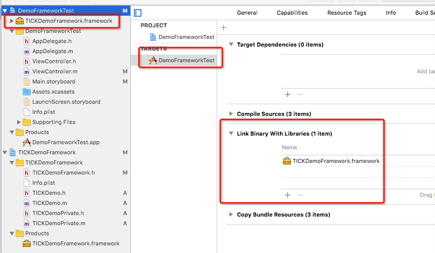

这样，每次在编译DemoFrameworkTest时，会自动使用最新的TICKDemoFramework.framework，免去手动更新的麻烦。

但是提供给外部时，往往仅提供一个TICKDemoFramework.framework文件。新建一个 _单独_ 的工程模拟framework的使用者工程，把framework的文件拖入：

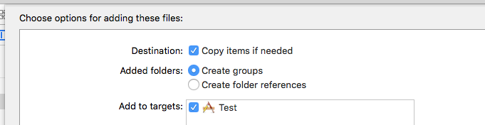

写入测试代码：

```
#import "ViewController.h"
#import <TICKDemoFramework/TICKDemoFramework.h>

@implementation ViewController

- (void)viewDidLoad {
    [super viewDidLoad];
    // Do any additional setup after loading the view, typically from a nib.
    TICKDemo *demo = [[TICKDemo alloc] init];
    NSLog(@"%@", [demo publicFuncName]);
}

@end
```

编译运行，此时，会发生错误：

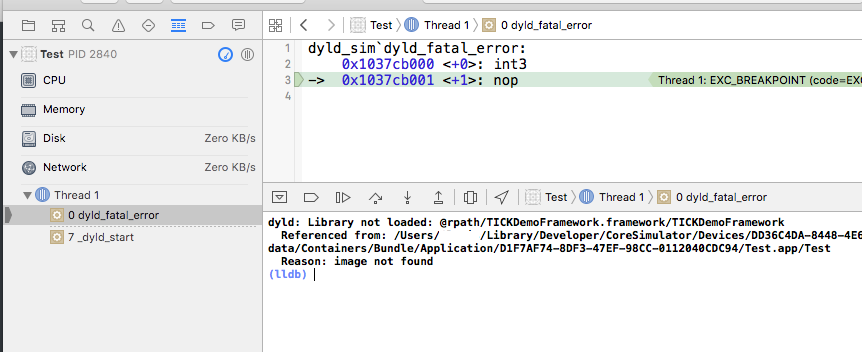

此时，需要做如下配置，把framework加入到copy file phase中

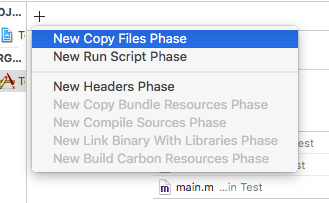

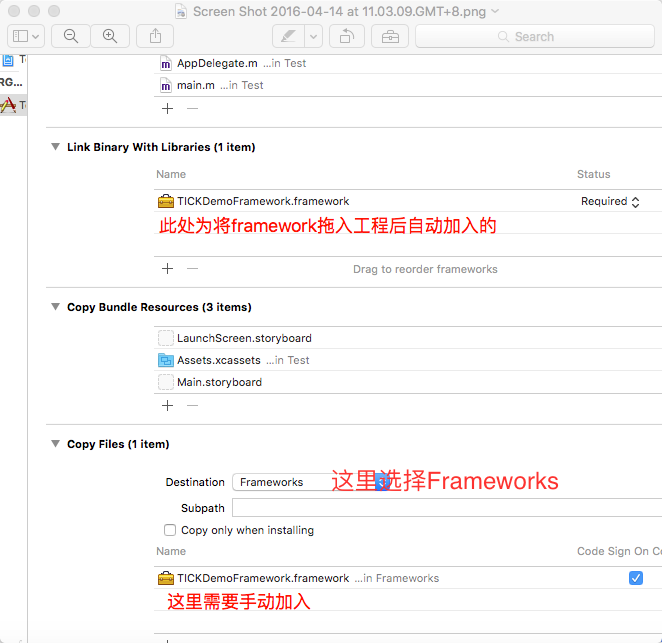

再次运行，成功！

以上只是在模拟器中运行，但是一旦换了架构，比如真机，就会报错了：

```
ld: warning: ignoring file ..../Test/Frameworks/TICKDemoFramework.framework/TICKDemoFramework
Undefined symbols for architecture arm64:
  "_OBJC_CLASS_$_TICKDemo", referenced from:
      objc-class-ref in ViewController.o
ld: symbol(s) not found for architecture arm64
clang: error: linker command failed with exit code 1 (use -v to see invocation)
```

查看这个动态库支持的类型，可以发现仅支持x86_64，也就是模拟器

```
xxx-Macbook-Pro:TICKDemoFramework.framework xxx$ lipo -info TICKDemoFramework 
Non-fat file: TICKDemoFramework is architecture: x86_64
xxx-Macbook-Pro:TICKDemoFramework.framework xxx$ 
```

这是因为，在编译framework时，仅选择了模拟器。若要支持其它架构，还需要选中其它设备的情况下编译，可以一个一个的选择并编译，可以按照如下命名：

```
TICKDemoFramework-x86_64.framework
TICKDemoFramework-arm64.framework
TICKDemoFramework-armv7.framework
TICKDemoFramework-i366.framework
```

但是这样很麻烦（除非你有足够的理由这么做），所以需要一种简便的方法，只运行一次就能将所有的framework都编译到一个framework文件中去。

这就是"Aggregate"(聚合)，Xcode中的简介是：
 `This target is used to aggregate other targets together.` 。
就是将其它的targets聚合在一起。

选中TICKDemoFramework工程，新增一个Target，选择Other->Aggregate。取名为“TICKDemoFramework-universal”，将通过它来制作通用framework


增加脚本(run script phase), 内容如下：

```
## 本脚本部分参考自：
# http://www.w2bc.com/Article/57360
# http://www.cocoachina.com/ios/20141126/10322.html

## 本脚本说明:
# 本脚本是为了生成通用动态库(universal framework)

## 使用说明:
# 下面假定工程名为"DemoFramework"，将本脚本framework-universal.sh放置在与"DemoFramework.xcodeproj"同级目录下,无需加入到工程管理中,但需要加入版本管理
# 为工程添加名为"DemoFramework-universal"的Target，这个Target的template为Ohter-->Aggregate
# 在此Target上添加"New Run Script Phase"，并填入内容本脚本路径(带引号):"${SRCROOT}/framework-universal.sh"
# 若需要传入参数，可以输入(带引号): "${SRCROOT}/framework-universal.sh" "based_target_name" "device_archs" "simulator_archs"
# 通过$1, $2, $3, $4获取，若某项不设置，需要设置为空字符""来占位，不影响后面的参数获取；若不设置，则采用默认设置生成
# 例如："${SRCROOT}/framework-universal.sh" "based_target_name" "device_archs" "simulator_archs" "product_fwk_name"
# $1: 根据哪个target编译
# $2: 支持的真机架构
# $3: 支持的模拟器架构
# 之后选择此scheme，build或archive即可。
# 若遇到权限错误，使用"chmod "a+x" framework-universal.sh"即可修复

# cocoapods
# 如果要生成的framework不依赖一些cocoapods生成的库，则不要在Podfile将framework的target加入
# 如果要生成的framework依赖一些cocoapods生成的库，需要确认arch支持

# !/bin/sh

# 如果命令执行时以非零值返回(即有错误),立即退出
# 你写的每个脚本都应该在文件开头加上set -e
# 这句语句告诉bash如果任何语句的执行结果不是true则应该退出。
# 这样的好处是防止错误像滚雪球般变大导致一个致命的错误，
# 而这些错误本应该在之前就被处理掉。
# 如果要增加可读性，可以使用set -o errexit，它的作用与set -e相同。
set -e

# 意义不明
set +u

# 避免递归调用脚本
if [[ $SF_MASTER_SCRIPT_RUNNING ]]
then
exit 0
fi

# 在参数扩展时，将未设置的的变量以错误对待。
# 如果在未设置的变量上扩展，shell会打印错误信息，如果没有交互，以一个非0状态退出。
# 关闭它，因为可能没有参数传入
# set -u

# 用户登录到Linux系统后，系统将启动一个用户shell。
# 在这个shell中，可以使用shell命令或声明变量，也可以创建并运行shell脚本程序。
# 运行shell脚本程序时，系统将创建一个子shell。
# 此时，系统中将有两个shell，一个是登录时系统启动的shell，另一个是系统为运行脚本程序创建的shell。
# 当一个脚本程序运行完毕，脚本shell将终止，返回到执行该脚本之前的shell。
# 从这种意义上来说，用户可以有许多 shell，每个shell都是由某个shell（称为父shell）派生的。
# 在子shell中定义的变量只在该子shell内有效。
# 如果在一个shell脚本程序中定义了一个变量，当该脚本程序运行时，这个定义的变量只是该脚本程序内的一个局部变量，其他的shell不能引用它，
# 要使某个变量的值可以在其他shell中被改变，可以使用export命令对已定义的变量进行输出。
# export命令将使系统在创建每一个新的shell时，定义这个变量的一个拷贝。这个过程称之为变量输出。
# 标记为正在执行
export SF_MASTER_SCRIPT_RUNNING=1

# 根据哪个target编译，默认为工程名，可通过参数改变，或在此直接修改
BUILD_BASED_TARGET=${PROJECT_NAME}

# framework的名称，默认为target名，可通过传入参数改变，或在此直接修改
# 需要与BUILD_BASED_TARGET一致
FRAMEWORK_NAME=${BUILD_BASED_TARGET}

# 默认支持的真机架构，可通过传入参数改变，或在此直接修改
ARCHITECURES_DEVICE="armv7 arm64"

# 默认支持的模拟器架构，可通过传入参数改变，或在此直接修改
ARCHITECURES_SIMULATOR="i386 x86_64"

# 有参数输入,编译所依赖的target名称
if [ ! -n "$1" ] ;then
    echo "== no target name input"
else
    echo "== input target name $1"
    FRAMEWORK_NAME=$1
fi

# 有参数输入,所支持的Device架构
if [ ! -n "$2" ] ;then
    echo "== no device arch input"
else
    echo "== input device arch $2"
    ARCHITECURES_DEVICE=$2
fi

# 有参数输入,所支持的simualtor架构
if [ ! -n "$3" ] ;then
    echo "== no simulator arch input"
else
    echo "== input simulator arch $3"
    ARCHITECURES_SIMULATOR=$4
fi

echo "== use based target to build ${BUILD_BASED_TARGET_NAME}"
echo "== use framework name ${FRAMEWORK_NAME}"
echo "== use device arch ${ARCHITECURES_DEVICE}"
echo "== use simulator arch ${ARCHITECURES_SIMULATOR}"

CONFIGURATION_NAME=${CONFIGURATION}
echo "== use configuration ${CONFIGURATION_NAME}"

# 生成的"DemoFramework-universal.framework"路径
# ...DerivedData/DemoFramework-aqphdajvjlmqatdzraujfowxqkno/Build/Products/Debug-universal/DemoFramework-universal.framework
# ...DerivedData/DemoFramework-aqphdajvjlmqatdzraujfowxqkno/Build/Products/Release-universal/DemoFramework-universal.framework
PRODUCT_DIR_UNIVERSAL=${BUILD_ROOT}/${CONFIGURATION_NAME}-universal/${FRAMEWORK_NAME}.framework
echo "== use prodcut universal dir ${PRODUCT_DIR_UNIVERSAL}"

# 当前设备路径
# ...DerivedData/DemoFramework-aqphdajvjlmqatdzraujfowxqkno/Build/Products/Debug-iphoneos/DemoFramework-universal.framework
# ...DerivedData/DemoFramework-aqphdajvjlmqatdzraujfowxqkno/Build/Products/Release-iphoneos/DemoFramework-universal.framework
PRODUCT_DIR_DEVICE=${BUILD_ROOT}/${CONFIGURATION_NAME}-iphoneos/${BUILD_BASED_TARGET}.framework
echo "== use prodcut device dir ${PRODUCT_DIR_DEVICE}"

# 当前模拟器路径
# ...DerivedData/DemoFramework-aqphdajvjlmqatdzraujfowxqkno/Build/Products/Debug-iphonesimulator/DemoFramework-universal.framework
# ...DerivedData/DemoFramework-aqphdajvjlmqatdzraujfowxqkno/Build/Products/Release-iphonesimulator/DemoFramework-universal.framework
PRODUCT_DIR_SIMULATOR=${BUILD_ROOT}/${CONFIGURATION_NAME}-iphonesimulator/${BUILD_BASED_TARGET}.framework
echo "== use prodcut simulator dir ${PRODUCT_DIR_SIMULATOR}"

# Clean、Build真机、模拟器的，framework如果有其它配置需要编译，可以将Release更改成相应名称
# 另一种命令方式
# xcrun xcodebuild 
# -project "${PROJECT_FILE_PATH}"
# -target "${TARGET_NAME}" 
# -configuration "${CONFIGURATION}" 
# -sdk ${SF_OTHER_PLATFORM}${SF_SDK_VERSION} 
# BUILD_DIR="${BUILD_DIR}" 
# OBJROOT="${OBJROOT}" 
# BUILD_ROOT="${BUILD_ROOT}" 
# SYMROOT="${SYMROOT}" 
# $ACTION
# xcodebuild -configuration "${CONFIGURATION}" -target "${TARGET_NAME}" -sdk iphoneos clean ${ACTION}
# 只有使用Release才能生成所有支持的架构，否则若工程设置为build active Architecture only，将生成不全
# 需要指定BUILD_DIR，否则会编译到xcodeproj文件的对应的目录中，导致后面的路径找不到
# 这里其它所有的参数，如果不指定，则按照工程设置中的参数
# 需要指定ARCHS和ONLY_ACTIVE_ARCH，否则会按照${CONFIGURATION_NAME}的设置编译
xcodebuild -configuration "${CONFIGURATION_NAME}" -target "${BUILD_BASED_TARGET}" -sdk iphoneos ARCHS="${ARCHITECURES_DEVICE}" ONLY_ACTIVE_ARCH=NO BUILD_DIR="${BUILD_DIR}" OBJROOT="${OBJROOT}" BUILD_ROOT="${BUILD_ROOT}" SYMROOT="${SYMROOT}" clean build
xcodebuild -configuration "${CONFIGURATION_NAME}" -target "${BUILD_BASED_TARGET}" -sdk iphonesimulator ARCHS="${ARCHITECURES_SIMULATOR}" ONLY_ACTIVE_ARCH=NO BUILD_DIR="${BUILD_DIR}" OBJROOT="${OBJROOT}" BUILD_ROOT="${BUILD_ROOT}" SYMROOT="${SYMROOT}" clean build

echo "== build end"

# 清除旧的Debug||Release-universal目录
if [ -d "${PRODUCT_DIR_UNIVERSAL}" ]
then
rm -rf "${PRODUCT_DIR_UNIVERSAL}"
fi

echo "== old product removed"

# 生成目录的Debug||Release-universal/DemoFramework-universal.framework目录
mkdir -p "${PRODUCT_DIR_UNIVERSAL}"

# 复制framework结构，便于生成新的framework
cp -R "${PRODUCT_DIR_DEVICE}/" "${PRODUCT_DIR_UNIVERSAL}/"
# 删除复制过来的无扩展名的framework文件(防止下一步的lipo create失败却仍有framework文件造成误会)
rm "${PRODUCT_DIR_UNIVERSAL}/${BUILD_BASED_TARGET}"

# 合并多个frameowrk为一个universal
# 可使用lipo -info Debug/Release-universal/DemoFramework-universal.framework/DemoFramework-universal查看
# 或者
# xcrun lipo -create
# "${BUILT_PRODUCTS_DIR}/$PRODUCT_NAME.framework/$PRODUCT_NAME"
# "${SF_OTHER_BUILT_PRODUCTS_DIR}/$PRODUCT_NAME.framework/$PRODUCT_NAME"
# -output "${PROJECT_DIR}/buildProducts/$PRODUCT_NAME"
lipo -create "${PRODUCT_DIR_DEVICE}/${BUILD_BASED_TARGET}" "${PRODUCT_DIR_SIMULATOR}/${BUILD_BASED_TARGET}" -output "${PRODUCT_DIR_UNIVERSAL}/${FRAMEWORK_NAME}"

echo "== lipo create end"
echo "== product archs" 
lipo -info "${PRODUCT_DIR_UNIVERSAL}/${FRAMEWORK_NAME}"

# 打开生成目录,便于使用
open "${PRODUCT_DIR_UNIVERSAL}"
```

好了，这下产生了新的framework，使用它，运行，发现无问题。那么问题到此结束。

与cocoapods结合时，有两种方案：

- 使用cocopods管理源码，使用pod "DemoFramework"来加载
- 手动添加对应的framework到使用工程中（这样的确定是每次修改framework后都需要替换旧的framework）

# 静态库